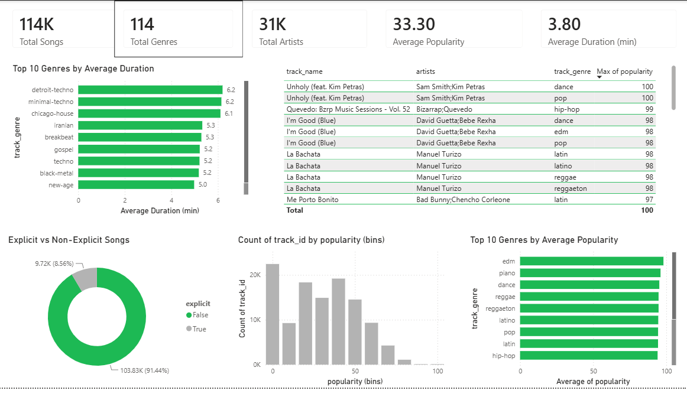

# Spotify Music Data Analysis

This repository presents an end-to-end analysis of the Spotify Tracks Dataset containing **114,000 songs** across **114 music genres**. The project covers data cleaning, SQL-based exploratory data analysis, and interactive Power BI dashboards to uncover insights into artist performance, genre popularity, track characteristics, and audio features.

---

## Dataset Overview

The dataset contains **113,549 Spotify tracks** across **114 music genres**, with information on song characteristics, artist details, and popularity.

| Column | Description |
|--------|-------------|
| `track_id` | Spotify ID of the track |
| `track_name` | Name of the track |
| `artists` | Artist(s) performing the track |
| `album_name` | Album name |
| `track_genre` | Music genre |
| `popularity` | Popularity score (0–100) |
| `duration_ms` | Track duration (milliseconds) |
| `explicit` | Explicit content indicator |
| `danceability`, `energy`, `key`, `loudness`, `mode`, `speechiness`, `acousticness`, `instrumentalness`, `liveness`, `valence`, `tempo`, `time_signature` | Audio features describing musical characteristics |

**Dataset Source:** [Spotify Tracks Dataset (Kaggle)](https://www.kaggle.com/datasets/maharshipandya/-spotify-tracks-dataset)

---

## Tech Stack

- **Microsoft Excel** – Initial data inspection and validation

- **MySQL** – Data cleaning, transformation, and exploratory data analysis (EDA)

- **Power BI** – Interactive dashboard development and data visualization

---

## Project Workflow

- **Data Inspection:** Initial review and validation of the dataset using Microsoft Excel.

- **Data Cleaning:** Handled duplicates, missing values, inconsistent values, and formatting using MySQL.

- **Exploratory Data Analysis:** Performed SQL-based analysis covering artists, genres, popularity trends, and audio features.

- **Dashboard Development:** Built an interactive Power BI dashboard to visualize key insights and enable data exploration.

---

## Key Insights

- Pop and related genres consistently recorded higher average popularity than many niche genres.

- A small group of artists contributed a significant share of highly popular tracks.

- Danceability and energy showed a moderate positive relationship with track popularity.

- Explicit tracks represented a relatively small proportion of the dataset.

